<div align="center">

# Arbiter

**Only debates when your business data actually disagrees.**

An AI decision engine for business data · BFWAI/HACK 26 · PS-04 · Team Aviator


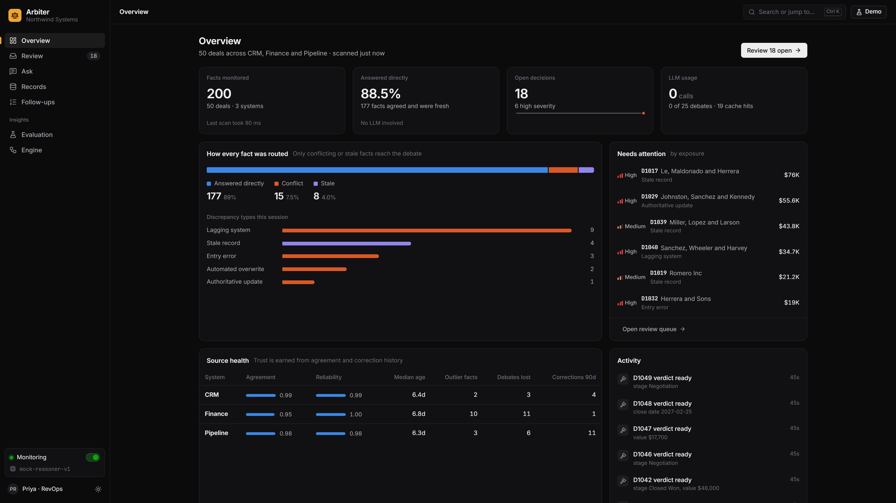

</div>

Your CRM says a deal closed at **$48,000**. Finance still has it open at **$45,000**. Pipeline agrees with the CRM
but was last touched a day ago. Someone usually spends half an hour cross-checking before trusting any of them.

Arbiter does that check continuously. It scores how trustworthy every fact is from **freshness, cross-system
agreement and correction history**, never from an LLM's opinion of itself. When the systems agree and the data is
fresh, it answers straight from the data: **177 of 200 facts need no AI at all**. Only when the data genuinely
conflicts or has gone stale does it run a structured **proponent / challenger / judge** debate over real audit
evidence. Every decision shows its evidence, an objective confidence score and **the argument that lost**, and nothing
changes until **a human approves it**.

- 📄 [Idea submission (PDF)](Arbiter%20-%20PS-04%20Idea%20Submission.pdf) · [PRD](docs/prd.md) · [Architecture deep-dive](docs/architecture.md)
- 🧭 [What changed from those docs, and why](docs/decisions.md) · 🎤 [4-minute live demo script](docs/demo-script.md)

## Contents

[Highlights](#highlights) · [Architecture](#architecture) · [Screenshots](#screenshots) · [Quick start](#quick-start) ·
[Evaluation](#evaluation) · [Project layout](#project-layout) · [API](#api) · [Team](#team)

---

## Highlights

- **AI only where it earns its cost.** A deterministic rule engine normalises, compares and scores every fact. Clean
  data never reaches a model.
- **Objective confidence.** `C = 0.5·Freshness + 0.15·Reliability + 0.35·Agreement`, computed from the data with a
  decay projection showing when a fact will go stale.
- **Evidence-bound debate.** A proponent and a challenger argue in parallel from an evidence packet built by code. A
  judge rules and must cite real evidence IDs, and a validator rejects anything that doesn't.
- **The losing argument is kept.** Every card answers "why not the other value?", so a reviewer can see what lost and
  why.
- **Human in the loop.** Nothing is written back until a named person approves. Approval syncs the losing systems and
  leaves an audit trail.
- **Live monitoring.** A background monitor re-scans every few seconds. An edit in any system is caught and turned
  into a decision within seconds.
- **Bias check on big deals.** High-stake conflicts are re-judged with the sides swapped. If the verdict flips, the
  decision is escalated to a human.
- **Cost controls.** At most 3 calls per conflict, debates cached by a hash of the conflict, and a per-session budget
  with a rule-based provisional fallback.

---

## Architecture

### System overview

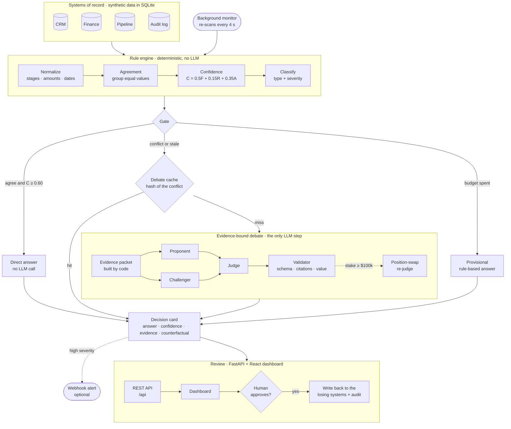

### One conflict, end to end

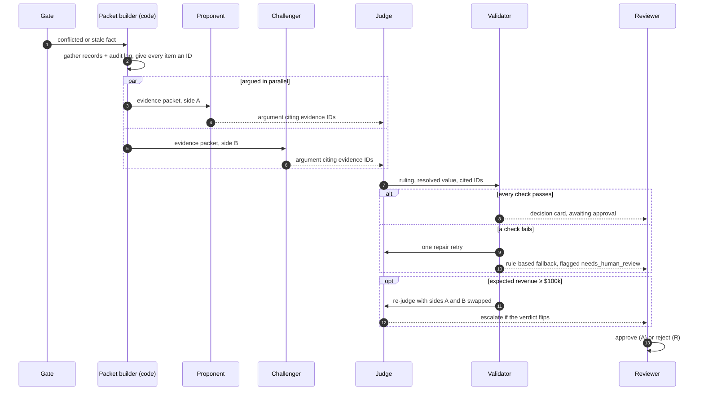

### Pipeline stages

| Stage | What happens | LLM? |
|---|---|---|
| **Normalize** | `"Closed Won"` = `"Closed - Won"` = `"closed-won"`; `48000` = `$48,000.00` = `48K` (±0.5%); `2026-10-15` = `10/15/2026` = `15 Oct 2026`; company casing and suffixes. | no |
| **Agree** | Groups equal values across systems. `A = largest group / sources`. Conflicted if more than one distinct value. | no |
| **Score** | `F = exp(−ln2·age/half_life[field])`, `R = 1 − min(0.5, corrections_90d / updates_90d)`, **`C = 0.5·F + 0.15·R + 0.35·A`** | no |
| **Classify** | Lagging system, entry error, automated overwrite, authoritative update, unexplained or stale record; severity from revenue at stake. | no |
| **Gate** | Conflict → debate · `C < 0.60` → stale → debate · otherwise → direct. Budget spent → provisional rule-based answer. | no |
| **Debate** | Code builds the evidence packet (records, audit log, context, each with an ID). Proponent and challenger argue in parallel; the judge rules and must cite real IDs. | **yes** |
| **Validate** | JSON schema with no extra keys (so no LLM "confidence"), cited IDs must exist, resolved value must be the winner's value. One repair retry, then a rule-based fallback flagged `needs_human_review`. | no |
| **Card** | Answer, objective confidence of the chosen value (F/R/A breakdown), evidence lineage, debate transcript, **counterfactual**, cost of being wrong, sunset timer. | no |
| **Approve** | `pending → approved / rejected`. Approval syncs the losing systems with an `arbiter_sync` audit entry, which also lowers that source's reliability score. | no |

---

## Screenshots

A walk through the dashboard following one conflict, deal **D1042**, from detection to approval. All data is
synthetic.

### Demo video

<div align="center">

<video src="arbiter-demo.mp4" controls muted width="100%"></video>

*End-to-end demo: a live edit creates a conflict, the gate routes it to an evidence-bound debate, and a human approves the sync.*

</div>

### Screenshots

<table>
  <tr>
    <td width="50%" valign="top">
      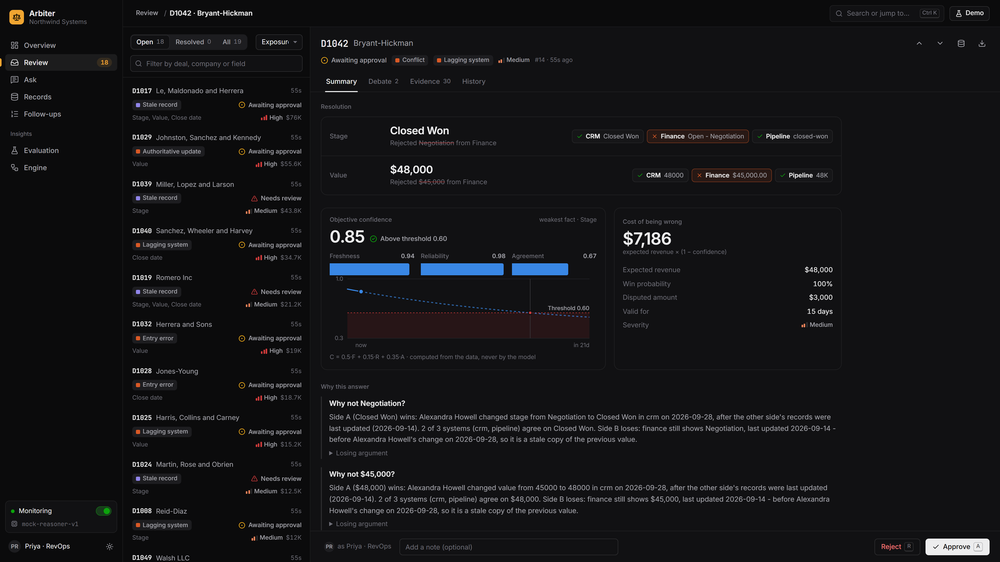
      <b>Decision summary</b><br>
      The resolution against every system, objective confidence with its freshness / reliability / agreement
      breakdown and decay projection, and the cost of being wrong.
    </td>
    <td width="50%" valign="top">
      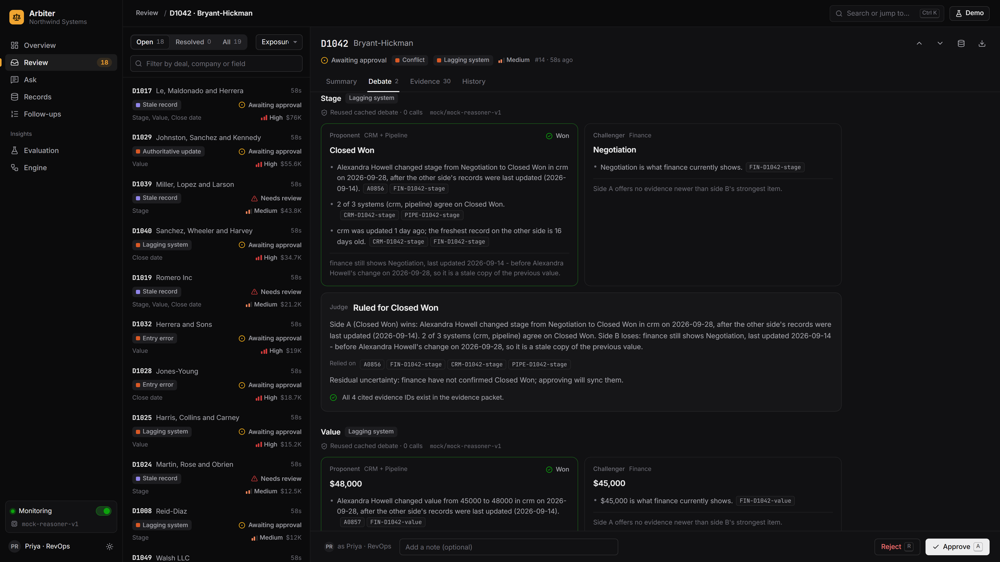
      <b>Evidence-bound debate</b><br>
      Proponent against challenger, the judge's ruling, and the verified checks:
      every cited evidence ID exists in the packet.
    </td>
  </tr>
  <tr>
    <td width="50%" valign="top">
      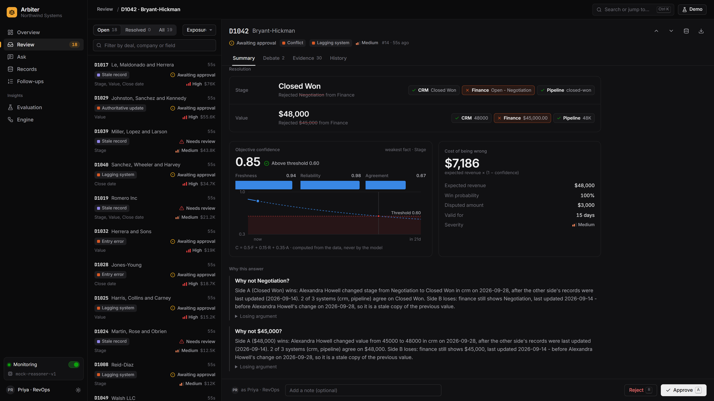
      <b>Counterfactual</b><br>
      "Why not Negotiation?" The losing argument is kept with the reason it lost.
    </td>
    <td width="50%" valign="top">
      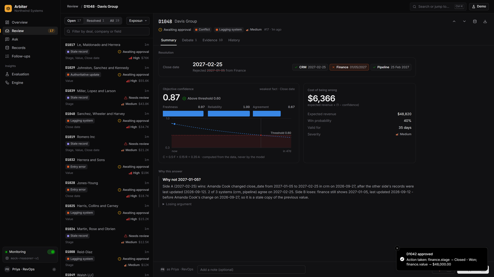
      <b>Human approval</b><br>
      Approve with one click (or <kbd>A</kbd>). The losing system is synced and the queue moves to the next item.
    </td>
  </tr>
  <tr>
    <td width="50%" valign="top">
      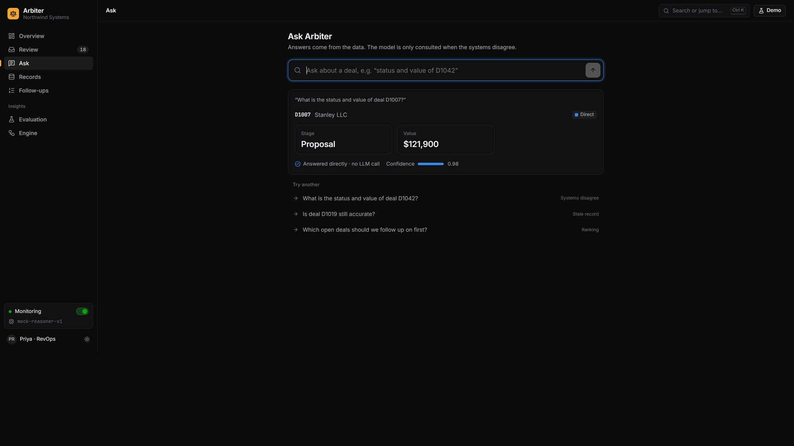
      <b>Ask</b><br>
      Plain-English questions. When the systems agree, the answer comes straight from the data with no LLM call.
    </td>
    <td width="50%" valign="top">
      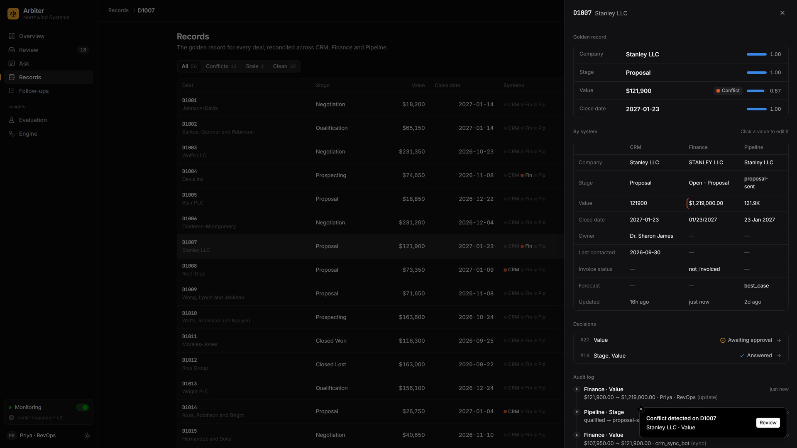
      <b>Live drift detection</b><br>
      Edit a system's value in Records (here, an extra zero in Finance) and the monitor raises a conflict within
      seconds.
    </td>
  </tr>
  <tr>
    <td width="50%" valign="top">
      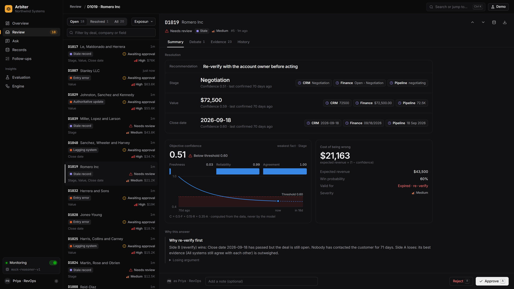
      <b>Stale data</b><br>
      Nobody disagrees, but the data is old. Confidence decays below 0.60, so Arbiter asks for re-verification
      instead of answering.
    </td>
    <td width="50%" valign="top">
      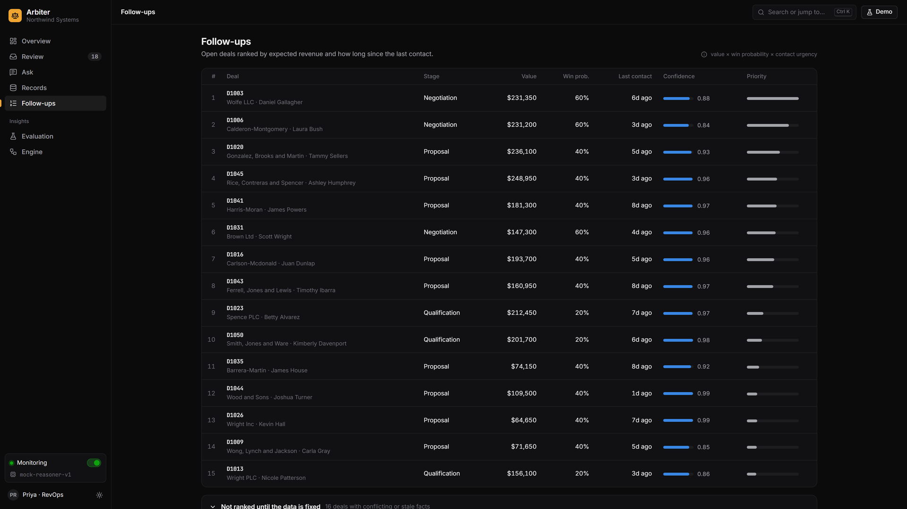
      <b>Follow-ups</b><br>
      Deals ranked by expected revenue and time since last contact. Deals with unresolved data are listed
      separately.
    </td>
  </tr>
  <tr>
    <td width="50%" valign="top">
      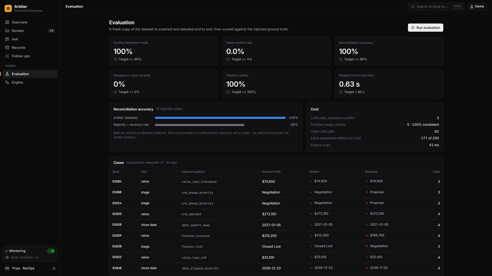
      <b>Evaluation</b><br>
      PRD metrics against their targets, and Arbiter against a majority-vote baseline on the same evidence.
    </td>
    <td width="50%" valign="top">
      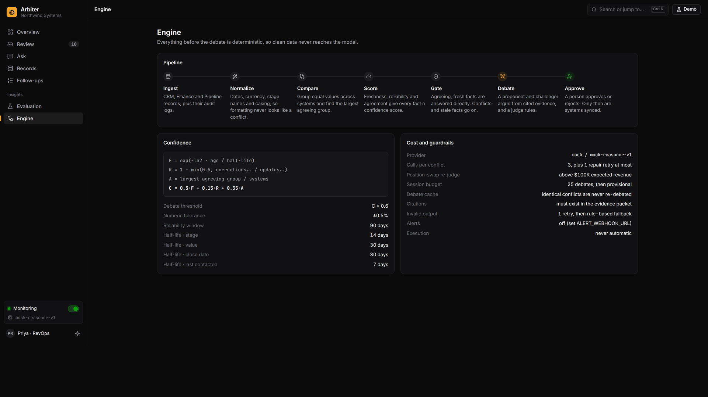
      <b>Engine</b><br>
      The pipeline, the confidence formula and every live parameter, in one place.
    </td>
  </tr>
  <tr>
    <td width="50%" valign="top">
      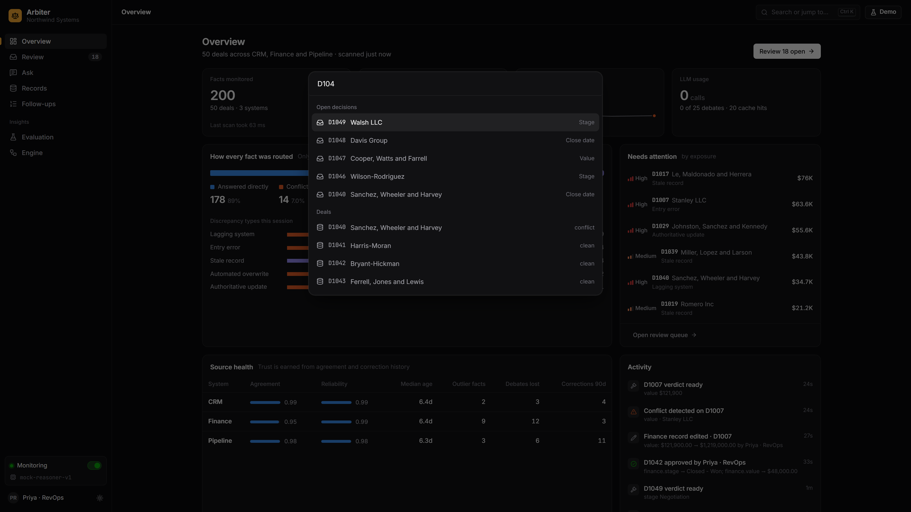
      <b>Command menu</b><br>
      <kbd>Ctrl</kbd>/<kbd>⌘</kbd> <kbd>K</kbd> jumps to any decision, deal or page and runs any action.
    </td>
    <td width="50%" valign="top">
      <b>Everywhere in the app</b><br><br>
      Review with <kbd>A</kbd> approve · <kbd>R</kbd> reject · <kbd>J</kbd>/<kbd>K</kbd> move.<br><br>
      The <b>Demo</b> menu scans, injects drift, fast-forwards the engine clock, exports CSV and resets.<br><br>
      Light and dark themes, live toasts from the monitor, and an activity timeline of every detection, verdict,
      approval and edit.
    </td>
  </tr>
</table>

---

## Quick start

Requirements: **Python 3.11+** and **Node 18+** (Node is only needed to build the dashboard once).

```bash
python run.py
```

Then open **http://localhost:8000**. The first run creates `.venv`, installs the backend, builds the dashboard, seeds
50 synthetic deals across three systems, and starts the background monitor. Everything runs locally on SQLite with
the **mock provider**: no API key and no network needed.

```bash
python run.py --reset      # reseed demo data before starting
python run.py --build      # force a dashboard rebuild
```

### Use a real LLM for the debate

```bash
cp .env.example .env       # then edit:
LLM_PROVIDER=claude        # or gemini
ANTHROPIC_API_KEY=...      # or GEMINI_API_KEY=...
```

- **Claude** (`claude-opus-5-5` by default) uses the Anthropic SDK with **structured outputs**. Each request's JSON
  schema is built from the evidence packet, so evidence IDs and resolved values are enums the model cannot step
  outside of. Depth is set with `LLM_EFFORT`, and server-side refusal fallbacks are enabled.
- **Gemini** (`gemini-2.5-flash` by default) uses the REST API with JSON mode and the judge temperature from `.env`.
- Every provider's output goes through the same validator (schema, citation and value checks).

---

## Evaluation

`python -m app.services.evaluation` (from `backend/`), or the **Evaluation** page. It seeds a throwaway copy of the
dataset with known injected problems, runs everything end to end, and compares the output with ground truth that the
engine and agents never see. The baseline applies "majority, then most recent" to the **same** evidence.

| Metric | Target | Result (mock provider) |
|---|---|---|
| Conflict detection recall | ≥ 95% | **100%** (15/15) |
| False-conflict rate (cosmetic differences) | ≤ 5% | **0%** |
| Reconciliation accuracy vs ground truth | ≥ 80% | **100%** (baseline: 68%) |
| Debate rate on clean records | 0% | **0%** (177 of 200 facts answered directly) |
| Citation validity | 100% | **100%** (enforced by the validator) |
| Time from conflict to decision card | < 1 min | **< 0.3 s** with the mock (a live model adds two sequential LLM rounds; not yet measured) |
| LLM calls per conflict | ≤ 3 | **3.0** (+1 swap re-judge on the 5 high-stake conflicts) |

> **Honesty note:** the mock provider is a deterministic, evidence-weighing reasoner. It reads only the packet, but
> it was written by the same people who wrote the injector, so its 100% accuracy is **not** a model result. Run
> `python -m app.services.evaluation --live` with Claude or Gemini configured to get model numbers (about 60 calls;
> debates already cached in the demo DB are reused). Detection recall, the false-conflict rate and the clean-debate
> rate come from the rule engine and do not depend on the provider.

Cases the baseline gets wrong and the debate gets right: a **stale majority** (CRM advanced the stage, but finance and
pipeline are old copies), an **authoritative minority** (billing issued the invoice at a different amount), a finance
**deal-lost** update with a voided invoice, a **pipeline-only** date slip, and a closed-and-paid record that is merely
old.

### Ideas adopted from similar projects

We researched comparable open-source projects. Each idea below is implemented, tested and visible in the UI.

| Feature | Inspired by | In Arbiter |
|---|---|---|
| **Discrepancy taxonomy + severity** | [multi-system-reconciliation-agent](https://github.com/kareembrantley-lab/multi-system-reconciliation-agent), [agentic-financial-reconciliation](https://github.com/chanupadeshan/agentic-financial-reconciliation) | Every conflict is classified deterministically and graded high / medium / low from revenue at stake. |
| **Position-swap judge check** | [Awesome-LLM-as-a-judge](https://github.com/llm-as-a-judge/Awesome-LLM-as-a-judge), [llm-committee](https://github.com/chenmoneygithub/llm-committee) | High-stake conflicts are re-judged with sides swapped; a flipped verdict goes to a human (the PRD's P2 "second judge" goal). |
| **Evidence-cited judging + verification** | [multi-agent-debate](https://github.com/salismt/multi-agent-debate) | Judges must cite packet IDs (enforced by the validator, and by enum schemas on Claude); the UI shows each check. |
| **Source trust scorecards** | truth discovery ([truthdiscovery](https://github.com/joesingo/truthdiscovery), [spectrum](https://github.com/totucuong/spectrum)) | Per system: agreement rate, reliability, median age, outlier facts, debates lost, corrections. |
| **Trend + decision analytics** | reconciliation trend charts; review-rate metrics | Open-issue trend, approval rate, flagged-for-review rate, median time to a human decision. |
| **Activity timeline, export, alerts** | [Elementary](https://github.com/elementary-data/elementary) alerts, n8n reconciliation workflows | `GET /api/activity`, `GET /api/export/decisions.csv`, and an optional Slack-compatible webhook (`ALERT_WEBHOOK_URL`). |

Good next steps we considered: claim tags (fact / inference / assumption) in the evidence ledger, a "request more
evidence" reviewer action, iterative truth-discovery weights feeding the confidence formula, and multi-round debates.

---

## Project layout

```
run.py                      one-command launcher
backend/
  app/config.py             every threshold, weight, half-life and budget (single source)
  app/schemas.py            Pydantic contract (cards, verdicts, requests)
  app/db.py                 SQLite store (all SQL lives here)
  app/data/                 generator (Faker, seeded) · injector (conflicts + ground truth) · seed CLI
  app/engine/               normalize · agreement · confidence · gate · assess · classify   ← pure, no LLM, no I/O
  app/agents/               llm (Claude/Gemini/Mock + budget) · prompts · packet · debate · validate · mock_reasoner
  app/services/             arbiter (scan/resolve/query) · decisions (card) · approvals · evaluation
  app/api/                  FastAPI routes under /api
  tests/                    129 tests: unit, property, validator, integration, API, features, eval
frontend/src/
  lib/                      api client · store (polling, actions) · hash router · formatting
  components/               app shell + ⌘K menu · UI primitives · hand-rolled SVG charts
  pages/                    Overview · Review + DecisionView · Ask · Records · Follow-ups · Evaluation · Engine
  styles/                   design tokens (light/dark, validated chart palette) · components
docs/                       prd · architecture · decisions · demo script · screenshots
data/                       arbiter.db, ground_truth.json, eval_report.json (generated, gitignored)
```

## API

| Method | Path | Purpose |
|---|---|---|
| POST | `/api/scan` | Run the engine over all deals; create or refresh conflicts and decision cards |
| GET | `/api/decisions` | List cards (`status`, `path`, `deal_id`, `summary=true`) |
| GET | `/api/decisions/{id}` | Full card with evidence and debate |
| POST | `/api/decisions/{id}/approve` | `{action: approve\|reject, actor, note}` |
| POST | `/api/query` | `{"q": "status and value of D1042"}` → card, or the priority list |
| GET | `/api/priorities` | Ranked follow-up list |
| GET | `/api/stats` | Direct vs debate, LLM calls, cache hits, budget, trend history, review analytics |
| GET | `/api/deals`, `/api/deals/{id}` | Per-deal facts, confidence, outlier systems, audit log |
| GET | `/api/activity` | Event timeline (detections, verdicts, approvals, edits, drift) |
| GET | `/api/sources/health` | Per-system scorecards |
| GET | `/api/export/decisions.csv` | Every decision and approval as CSV |
| GET/PATCH | `/api/sources/{source}[/{deal_id}]` | View or live-edit a system of record |
| POST | `/api/demo/inject`, `/api/demo/reset`, `/api/demo/clock`, `/api/demo/monitor` | Demo controls |
| POST/GET | `/api/eval/run`, `/api/eval/latest` | Evaluation |

Interactive docs: http://localhost:8000/docs

## Tests

```bash
cd backend
../.venv/Scripts/python -m pytest -q      # Windows  (../.venv/bin/python on macOS/Linux)
```

## Safety

Synthetic data only: no real customers, no OAuth, and no writes to real CRMs. No action executes without a named
human approving it, and every approval is logged. There are no secrets in the repo; keys live in `.env`, which is
gitignored.

## Team

**Team Aviator** · BFWAI/HACK 26 · PS-04 AI Decision Engine for Business Data

- Piyush Anand · [@PiyushAnand2006](https://github.com/PiyushAnand2006)
- Somesh Srivastava · [@GeekSomesh](https://github.com/GeekSomesh)
- Praman Patel
